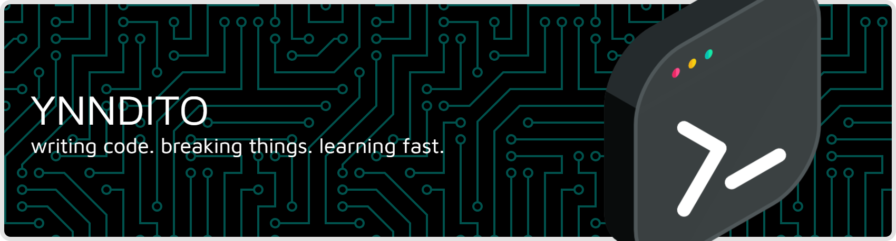

## 👨‍💻 About Me  Hey there, I’m ynndito — a junior web developer who loves crafting digital ideas into reality.   Code is my canvas, and every commit is a brushstroke 🨠 💡 What I Do: - Build and design web apps using **PHP | Laravel | JavaScript** - Focus on clean UI/UX with **TailwindCSS** and **Bootstrap** - Learn new tech every week to keep evolving ⚙️  🌱 Always improving, always creating — one line of code at a time 🚀 

## 🌐 Socials:
  

# 💻 Tech Stack:

  
  
  
  
  
  
  
  
  
  
  
  
  
  
  
  
  
  
  
  
  
  
  
  
  
  
  
  
  
  
  
  
  
  
  
  
  
  
  

###

###

  
  
  
  

###

<picture>
  <source media="(prefers-color-scheme: dark)" srcset="https://raw.githubusercontent.com/ynndito/ynndito/output/pacman-contribution-graph-dark.svg">
  <source media="(prefers-color-scheme: light)" srcset="https://raw.githubusercontent.com/ynndito/ynndito/output/pacman-contribution-graph.svg">
  
</picture>

###

  

### ✍️ Random Dev Quote

---

<!-- Proudly created with GPRM ( https://gprm.itsvg.in ) -->
<!--
**ynndito/ynndito** is a ✨ _special_ ✨ repository because its `README.md` (this file) appears on your GitHub profile.

Here are some ideas to get you started:

- 🔭 I’m currently working on ...
- 🌱 I’m currently learning ...
- 👯 I’m looking to collaborate on ...
- 🤔 I’m looking for help with ...
- 💬 Ask me about ...
- 📫 How to reach me: ...
- 😄 Pronouns: ...
- ⚡ Fun fact: ...
-->
